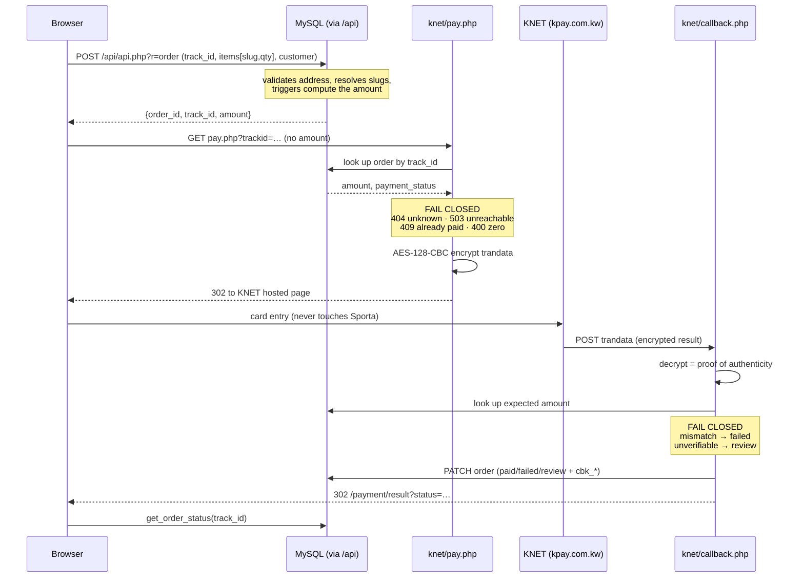

# KNET payments — full structure and plan

Everything about how Sporta takes money, in one place: what each piece does,
what the money path actually is, where the money-safety guarantees come from,
what is verified, and what is left to do.

Sporta uses **classic KNET (KPG)** — the AES-`trandata` model, native PHP on
Hostinger. Credentials come from the acquiring bank (CBK) as a **Tranportal**
set, not from KNET Co directly. The alternative CBK REST-JSON T-Pay model lives
in `sporta-web/dropin/php-cbk/` and is **not** what is deployed.

---

## 1. Structure

### 1.1 Where the code lives

| Path | Ships to | Role |
|---|---|---|
| `sporta-web/dropin/php-knet/knet.php` | `public_html/knet/` | Crypto + helpers. AES-128-CBC, HTTPS guard, order lookup, audit log. Never served (denied in `.htaccess`). |
| `sporta-web/dropin/php-knet/pay.php` | `public_html/knet/` | Starts a payment. Prices the order server-side, builds encrypted `trandata`, redirects to KNET. |
| `sporta-web/dropin/php-knet/callback.php` | `public_html/knet/` | Receives KNET's result. Decrypts, verifies, writes the order, redirects the customer. |
| `sporta-web/dropin/php-knet/api/index.php` | `public_html/knet/api/` | JSON API for the Flutter app. Delegates order creation to `create_order`. |
| `sporta-web/dropin/php-knet/config.example.php` | — | Template. |
| `config.php` | **server only** | Real credentials. Never committed, never in the zip, never uploaded, protected by the deploy keep-list. |
| `sporta-web/dropin/php-knet/setup-config.php` | `public_html/knet/` | CLI-only generator for `config.php`. **Delete after install.** |
| `sporta-web/dropin/php-knet/selftest.php` | `public_html/knet/` | Readiness check. **Delete after install.** |
| `sporta-web/dropin/php-knet/.htaccess` | `public_html/knet/` | HTTPS + canonical host, `no-store`, `noindex`, denies `config.php`/`knet.php`/`setup-config.php`/`*.log`. |
| `sporta-web/src/lib/checkout.js` | `dist/` | Browser side: calls `create_order`, then sends the customer to `pay.php`. |
| `sporta-web/src/pages/PaymentResult.jsx` | `dist/` | The page KNET's callback finally lands the customer on. |
| `sporta-web/dropin/php-store/*.sql` | `public_html/api/` | Order tables, the server-side pricing trigger, the catalogue seed and the brands. Import order in §3. |
| `sporta-web/dropin/php-store/store.php` | `public_html/api/` | `store_create_order()` — the shared checkout core both the shop and the gateways price from. |

`npm run release` bundles `dropin/php-knet/` into `dist/knet/`, excluding
`config.php`, so one deploy ships the site and the endpoints together.

### 1.2 The money path



### 1.3 Price authority — the core guarantee

**The browser never states a price, at any point.**

1. `create_order` takes only slugs and quantities. `trg_set_item_price` copies
   the price from `products`; `trg_recompute_amount` sets `orders.amount`.
2. `pay.php` is called with **no `amount` parameter**. It reads the figure from
   the order it looks up.
3. `callback.php` re-reads the stored amount and compares it to what KNET says
   was captured.

Proven by decrypting real `trandata`: a browser asking for 0.100 produced a
KNET request for 24.000.

### 1.4 Fail-closed rules

| Where | Condition | Outcome |
|---|---|---|
| `pay.php` | order not found | **404**, no payment started |
| `pay.php` | database unreachable | **503** |
| `pay.php` | already paid | **409** (blocks double payment) |
| `pay.php` | amount ≤ 0 | **400** |
| `callback.php` | `trandata` missing / undecryptable | `?status=error`, nothing written |
| `callback.php` | captured amount ≠ stored amount | `failed` + `AMOUNT_MISMATCH` |
| `callback.php` | amount unverifiable (DB down, order gone, no `amt`) | **`review`** — never silently paid |
| `callback.php` | DB write fails after 1 retry | logged as `callback.db_write_failed` |
| `create_order` | unknown/inactive slug | `unavailable_<slug>` |

The `neq.paid` guard on the failure path means a replayed or late failure
callback can never un-pay a captured order.

### 1.5 Authenticity

Classic KPG has no HMAC header. Authenticity comes from the fact that
`trandata` is AES-128-CBC encrypted with the **Terminal Resource Key**, which
only the bank and the server hold. A payload that decrypts to well-formed
fields could only have been produced by someone holding that key. A callback
forged with any other key fails `knet_decrypt` and is rejected before anything
is read — verified in the test suite.

### 1.6 Order states

| `payment_status` | Set by | Meaning |
|---|---|---|
| `pending` | `create_order` | Created, not paid. Normal at redirect time. |
| `paid` | `callback.php` | Captured **and** amount verified. Only state that ships. |
| `failed` | `callback.php` | Declined, cancelled, or amount mismatch. |
| `review` | `callback.php` | Bank may have captured; the server could not verify. **Needs a human.** |

`fulfilment_status` (`unfulfilled → packed → shipped → delivered / cancelled`)
is separate and admin-driven.

### 1.7 Crypto specifics

- AES-128-CBC, PKCS7, key = Terminal Resource Key (**exactly 16 bytes** —
  `knet_assert_key` refuses anything else, because PHP would otherwise pad
  silently and KNET would reject every transaction with no useful error).
- Fixed IV `PGKEYENCDECIVSPC`.
- `trandata` hex-encoded, uppercase.
- Fields: `id`, `password`, `action=1`, `langid`, `currencycode=414` (KWD),
  `amt`, `responseURL`, `errorURL`, `trackid`, `udf1..5`.
- Success = `result` is `CAPTURED` or `APPROVED`.
- Test `kpaytest.com.kw` → production `kpay.com.kw`, `/kpg/PaymentHTTP.htm`.

### 1.8 Audit log

`knet_log()` writes append-only JSONL, `chmod 600` on creation, **outside**
`public_html`. Events: `pay.init`, `pay.reject`, `pay.error`,
`callback.received`, `callback.unverified`, `callback.amount_mismatch`,
`callback.db_write_failed`. No secrets, no card data.

---

## 2. What is verified

| Suite | Covers |
|---|---|
| `npm run test:native` (36/36) | The `/api` contract itself: validation tokens, price authority, stock, invoices, brands, admin auth and its five-failure lock. |
| `npm run test:native-e2e` (20/20) | The built site in a real browser against real MariaDB — product page to order to invoice to the admin, every admin tab walked. |
| `npm run test:knet` (39/39) | The whole card path on the NATIVE backend against real MariaDB and a fake gateway that speaks the real Tranportal protocol (`scripts/fake-knet-bank.php`): the trandata this code encrypts is decrypted by an INDEPENDENT AES implementation in Node, the amount charged comes from the database and an `?amount=` in the URL is ignored, the callback answers `REDIRECT=` so a server-to-server gateway can bring the customer home, replays change nothing, underpayment/cancel/garbage all fail closed, and a captured card whose callback never arrived can be settled by an operator only with the bank's payment id. |
| `php -l` | All endpoints parse. |

Run them against a database built by importing `dropin/php-store/schema.mysql.sql`,
`seed.mysql.sql` and `brands.mysql.sql` in that order — the same order §3
documents, so the documented order is the one the tests actually exercise.

---

## 3. Plan

### P0 — before any live payment

1. **Import the SQL** (phpMyAdmin, in order): `api/schema.mysql.sql`,
   `api/seed.mysql.sql`, `api/brands.mysql.sql`. Every test suite runs against
   a database built this way, so the order is verified, not just documented.
2. **Confirm the catalogue loaded.** `seed.mysql.sql` does it; Backends →
   Catalogue → Push products is the browser equivalent. Orders price from that
   table, and empty means every checkout is refused.
3. **Create `config.php`** in hPanel File Manager from `config.example.php`
   (SSH is off, so `setup-config.php` is not available to this host).
4. **Register `https://www.sporta.com.kw/knet/callback.php`** with the bank as
   both `responseURL` and `errorURL`.
5. **Test transaction** on `env: 'test'` against `kpaytest.com.kw` — a real
   0.100 KWD payment returning `CAPTURED`. Confirm the order flips to `paid`
   in the admin, not just that the browser showed a tick.
6. **Switch `env` to `production`** with production credentials, repeat once.
7. **Delete `setup-config.php` and `selftest.php`** from the server.

> Item 5 is the one that matters. A green result page proves the redirect
> worked; only the admin row proves the money was recorded. That distinction is
> exactly what the column-name bug hid.

### P1 — the remaining money-safety gap

**Abandoned callbacks.** Classic KPG is redirect-only: there is no
server-to-server webhook. If the customer closes the browser after the bank
captures but before the redirect fires, `callback.php` never runs, and the
order stays `pending` while the money is gone. Nothing in the current design
detects this.

Recommended, in order:

1. **Stale-pending alert in the admin** — surface orders `pending` for more
   than ~30 minutes. Cheap, and it turns a silent loss into a visible queue.
2. **Daily reconciliation** — compare the KNET settlement report against
   `orders`, flagging captured-but-not-`paid` and `paid`-but-not-settled.
3. **Payment inquiry** — if the bank enables KPG's inquiry endpoint, a small
   job can resolve stale `pending` orders automatically.

Also P1:

4. **Alert on `callback.db_write_failed`.** Today it only reaches a log file
   nobody watches; it means money was taken and not recorded.
5. **Work the `review` queue.** The status exists and the admin counts it;
   there is no defined procedure for clearing one.

### P2 — completeness

6. **Order confirmation** to the customer on `paid` (email/WhatsApp). Nothing
   is sent today. Needs the SPF/DKIM/DMARC records in `DNS-EMAIL-RECORDS.txt`
   first, or it lands in spam.
7. **Refunds / voids.** Not implemented at all — `action=2` (refund) and void
   are unbuilt. Refunds are currently a manual bank-side operation with no
   record in `orders`.
8. **Log rotation** for the JSONL audit file.
9. **Receipt** — `cbk_receipt` and `cbk_paytype` are now captured but unused.

### Explicitly not planned

- **Storing card data.** Card entry stays on the bank's hosted page. This is
  what keeps Sporta out of PCI-DSS scope. Do not add an on-site card form.
- **`php-cbk/` (T-Pay REST-JSON).** A second, unused integration path. Keep it
  dormant unless the bank migrates the account.

---

## 3a. Pointing the card path at the orders database

`knet/config.php` has to be TOLD which database holds the orders — it is a
separate file from `api/config.php` and shares nothing with it automatically:

```php
'mysql_host' => 'localhost',
'mysql_name' => '...',   // the same database as api/config.php,
'mysql_user' => '...',   // where these four keys are spelled db_*
'mysql_pass' => '...',
```

Leave them blank and `pay.php` has no amount to charge: every card is refused
with `400 Invalid amount` and every captured payment goes unrecorded. That is
not hypothetical — it is what happened, and `npm run test:knet` exists because
of it.

Without it the whole card path is dead, and silently: `knet_db_configured()`
answered "no database", so `pay.php` refused every payment with **400 Invalid
amount** (the storefront sends no amount, by design — the price must come from
the server) and `callback.php` skipped the write entirely, leaving the MySQL
branch inside it unreachable and every captured payment unrecorded. Both are
fixed and both are now covered by `npm run test:knet`; `knet/selftest.php`
reports the database it will use, and says so loudly when there is none.

## 3b. How the customer gets home — confirm this with the bank

KPG has two deployment styles and the merchant cannot tell which one an
account has been given:

* the gateway **redirects the browser** to `responseURL`; or
* the gateway calls `responseURL` **server to server** and reads the token
  `REDIRECT=<url>` out of the reply, then sends the browser there itself.

A plain HTTP 302 is correct for the first and useless for the second — the
shopper is left on a blank bank page with the money taken. `callback.php`
therefore answers BOTH at once by default (`'callback_response' => 'both'`):
HTTP 200, `REDIRECT=<url>` on the first line, then a meta refresh and a link.
Set it to `'redirect'` only if the bank confirms the browser-redirect style.

**This is the one thing to ask CBK when the account goes live.**

## 3c. When the bank took the money and never told us

KPG reports through the customer's browser, so a closed tab loses the message:
the money is captured and the order sits at `pending` (or `review`, where the
callback parks anything it could not verify). This cannot be designed away — it
is inherent to a browser-delivered result.

The admin's order drawer therefore has a settle control for card orders, and it
demands the **KNET payment id** typed in from the KNET portal. That is the
forcing function: it cannot be filled in without having looked the transaction
up. The order is recorded as `MANUAL_BANK_CONFIRMED`, never as a bank callback,
so a manual settlement is always distinguishable when the books are read. Cash
orders keep their own control and cards still cannot be settled on a hunch.

---

## 4. Failure runbook

| Symptom | Cause | Action |
|---|---|---|
| `404 Unknown order` at Pay | `schema.mysql.sql` not imported, or the order was never created | Import the SQL |
| `Order has no payable amount` | `products` table empty | Admin → Catalogue → Push products |
| KNET rejects every transaction | `resource_key` not exactly 16 bytes | `knet/selftest.php` names it |
| Every card refused with `400 Invalid amount` | no `mysql_*` values in `knet/config.php` | Fill them in — see §3a |
| Customer sees success, order stays `pending` | `callback.db_write_failed` in the log | Check the log; fixed for the column-mismatch cause |
| Order stuck at `review` | Amount could not be verified | Compare against the bank statement by `cbk_paymentid`, then set manually |
| `503` at Pay | the orders database is unreachable | Correct — no payment starts. Check the `mysql_*` values and that MySQL is up |
